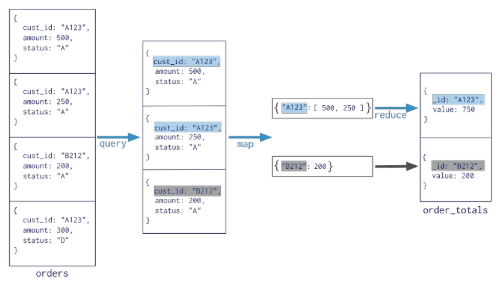
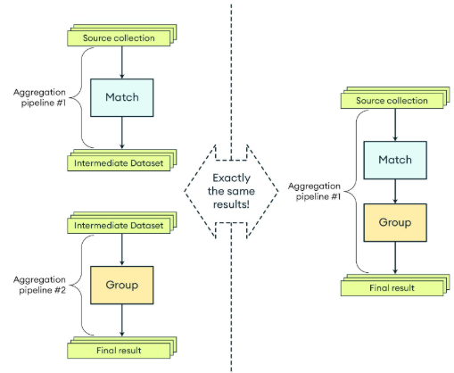
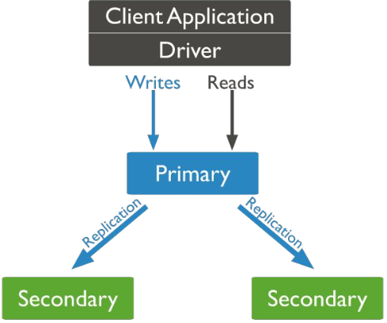
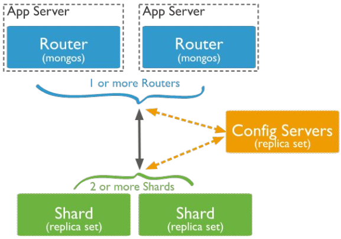

  
# Seminar M2L11: Расширенные функции MongoDB - Aggregation Framework (7.06.24)

find не может в агрегацию.  
При помощи `find` можем получить данные, а агрегацию при помощи языка программирования.
Однако образуется ботлнек, т.к. БД быстрее языка + язык выделяет память на вычисления.

## Map Reduce (Deprecated)
-  Специальный механизм для выполнения агрегации данных в Mongo
- Состоит из двух стадий `map` и `reduce` + optional `finalize`.
- На стадии `map` выполняется итерация по каждому документу и генерирует промежуточный результат в виде пар ключ-значение.
- Стадия `reduce` принимает промежуточный результат и объединяет эти данные. Как правило выполняет агрегацию (суммирование и т.д.)
- `finalize` позволяет дополнительно обработать данные.
- Для выполнения использует императивный подход с использованием JS/
  
```javascript
db.orders.mapReduce(
	function() {emit(this.cust_id, this.amount);}, //map
	function(key, values) {return Array.sum(values)}, //reduce
	{
		query: {status: "A"},
		out: "order_totals"
	}
)
```

  

## Aggregation Framework

- инструмент обработки и агрегирования данных

- работает как pipeline инструкций. Каждая инструкция (**stage**/этап) обрабатывает данные (фильтр, сорт, агрег.) и передает результат дальше.  

- Спец. синтаксис **MQL** MongoDB Query Language.



**Основные компоненты:**

- **$match** (~**WHERE**/**HAVING**) - фильтрация
- **$group** (~**GROUP BY**) - группировка
- **$project** - изменяет входные данные через добавления/удаление/переименование
- **$sort** (~**ORDER BY**) - сортировка
- **$limit** и **$skip** (~**LIMIT**) - лимитация и пропуск записей (пагинация)
- **$unwind** - разделяет массив внутри документа на отдельные массивы
- **$lookup** (~**JOIN**) - присоединяет коллекции
- **$addFields**/**$set**/**$unset** - добавляет новые поля изименяет значения существующих полей в документе

**Операторы для агрегации:**

- **$sum** (~**SUM**) 
- **$avg** 
- **$min** /**max** 
- **$concat** - объединяет данные
- **$first** и **$last** - первый и последний документ

**Операторы для массивов:**

- **$arrayAtElem** - получить значение по индексу 
- **$size** - размер массива
- **$concatArrays** 
- **$filter** - 
- **$map** - функция для каж. элемента
- **$push**/**$addToSet** - добавление/добавление без дубликатов

**JOIN**

```javascript

db.orders.aggregate([
	{ 
		$lookup: {
			from: "products", // внешняя коллекция
			localField: "product_id", // поле в коллекции orders
			foreignField: "_id", // поле в коллекции products
			as: "product_details" // поле в результирующих документах
		}
	},
	{
		$set: {
			"product_details": {"$first": "$product_details"} // Оставляем только первый документ
		}
	}
])
```
**Свои функции**
```javascript
db.documents.aggregate([
	{
		$addFields: {
			customCalculation: {
				$function: {
					body: function(value1, value2) {
						return (value1 * value2) + 10;
					}
					args: ["$value1", "$value2"], // аргументы, которые будут переданы в функцию
					lang: "js" //язык, на котором написана функция
				}
			}
		}
	}
])
```

### Ограничения по памяти

- По умолчанию каждая операция в агрегационном пайплайне ограничена 100 МБ оперативной памяти...
- `allowDiskUse: true` - для обхода этого ограничения и использования дискового пространства в случае превышения лимита.

### Оптимизация 

- Строить индексы. Операторы **$match** и **$sort** в начале пайплайна могут эффективно использовать индексы для ускорения обработки.
- Использовать раннюю фильтрацию данных.
- Избегать выполнения **JS**.
- Использовать **$lookup** мудро.
- Использовать **$set/unset** вместо **$project/unwind**


## Администрирование

- Для создания пользователей используется метод db.createUser.
- Для пользователей можно задавать разнообразные роли read, write, dbAdmin, root,
clusterAdmin и т.д.
- Создаем пользователя с админскими правами через метод для admin базы данных.
- Включаем авторизация через security в конфиге
- Создаем пользователей для других баз данных с более усеченными правами.

**Команды**

● db.getUser() - получить юзера.
● db.getRole() - получить список зарегистрированных ролей
● db.createUser() - создание пользователя
● db.createRole() - создание новой роли

## Масштабирование

**Репликация** — это процесс поддержания синхронных копий базы данных на нескольких
серверах. Репликация обеспечивает высокую доступность данных и защиту от сбоев
оборудования.

**Шардинг** — это метод распределения данных по нескольким серверам для
горизонтального масштабирования базы данных. В MongoDB шардинг позволяет
разбираться большие коллекции и базы данных на меньшие части (шарды) и
распределять эти части по различным серверам.

## Репликация

- Высокая доступность. В случае выхода одного из серверов, другой возьмет роль
лидера.
- Надежность данных. Бэкап это хорошо, но нужно время на его развертывание.
- Масштабируемость. Пишем на один узел, но можем читать из разных узлов.
- Удобство обслуживания. Снимаем бэкапы с реплик, проводим обновления без
остановки системы.



### Как реализовать?

- Создаем несколько серверов MongoDB. Как правило их должно быть нечетное
количество 3-5-7 и т.д., запущенные на разных физических серверах.
- Объединить в кластер через команду rs.init(). Туда мы передаем конфигурацию со
списком хостов репликации.
- После инициализации подключаемся к базе, как к кластеру. Указываем все адреса
хостов в кластере.

## Шардирование

- Горизонтальное масштабирование записи и чтения: данные распределяются по
нескольким серверам, что позволяет обрабатывать больше запросов одновременно.
- Поддержка больших объемов данных: позволяет хранить и обрабатывать данные,
превышающие возможности одного сервера.
- Балансировка нагрузки: распределение данных и запросов по нескольким серверам
снижает нагрузку на каждый отдельный сервер.



### Как реализовать?

- Создаем несколько серверов MongoDB и Mongos. Создаем мини кластера из 3 и более
машин для шардирования, для сервера конфигурации и 1 или более машин для
балансировки трафика(mongos). Получается 10 машин минимум - 3 для одного шарда, 3
длā другого, 3 длā сервера конфигурации, 1 длā балансировщика.
- Инициализируем каждый мини-кластер. Запускаем в режиме репликации
- Объединяем кластера для шардирования. Используем команд addShard
- Выбираем коллекцию для шардирования. Как правило, это большая коллекция с
множеством данных с хорошим ключом шардирования.