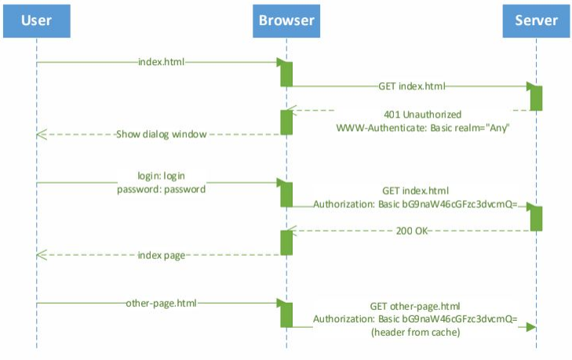

  
# Seminar M2L12: Аутентификация и Безопасность  (11.06.24)

## Аутентификация

Аутентификация — это проверка, что вы действительно тот человек, за которого себя выдаёте.

Способы аутентификации: пароль, биометрия, токены доступа, многофакторная аутен. (MFA)

### Виды
1. **Basic Auth**

Плюсы: 
 1. Встроенная поддержка браузера
 2. Стандарт веб-сервисов
 3. No cookies
 4. Простая схема, передается в загаловке
Минусы 
 1. Без HTTPS опасно
 2. Невозможная кастомизация логина (SMS, прочее)
 3. Непонятно как делать Logout
 
2. **Form-Based Auth**

Алгоритм: 
- Пользователь через веб-форму вводит логин и пароль
- Отправка данныых на спец. HTTP endpoint
- Endpoint проверяет верность логина и пароля
- Выдается токен доступа (обычно хэш с ограниченным временм жизни)
- Пользователь использует его для входа пока он не "протухнет"
