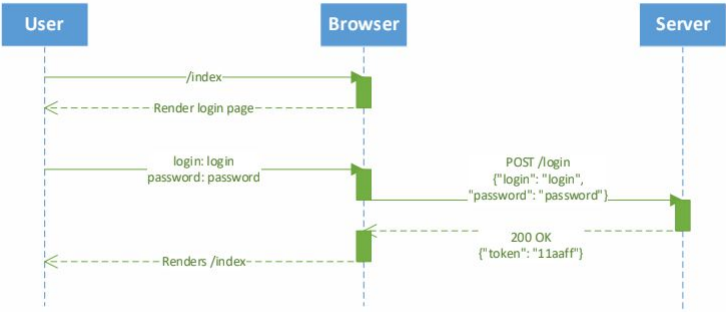

  
# Seminar M2L12: Аутентификация и Безопасность  (11.06.24)

## Аутентификация

Аутентификация — это проверка, что вы действительно тот человек, за которого себя выдаёте.

Способы аутентификации: пароль, биометрия, токены доступа, многофакторная аутен. (MFA)

Авторизация(authorization — разрешение, уполномочивание) - это проверка прав пользователя на доступ к определенным ресурсам.

### Виды
1. **Basic Auth**

Плюсы: 
 1. Встроенная поддержка браузера
 2. Стандарт веб-сервисов
 3. No cookies
 4. Простая схема, передается в загаловке
Минусы 
 1. Без HTTPS опасно
 2. Невозможная кастомизация логина (SMS, прочее)
 3. Непонятно как делать Logout
 
2. **Form-Based Auth**

Алгоритм: 
- Пользователь через веб-форму вводит логин и пароль
- Отправка данныых на спец. HTTP endpoint
- Endpoint проверяет верность логина и пароля
- Выдается токен доступа (обычно хэш с ограниченным временм жизни)
- Пользователь использует его для входа пока он не "протухнет"

Плюсы: 
 1. Кастомизация для веб-приложений
 2. Самая популярная схема
 3. Логаут легкий - удаляем куку
Минусы 
 1. Обычно для веб-сервисов как-то отдельно пропускают логин и сразу выдают токен
 2. Без HTTPS - пароль и логин опять в открытую
 3. Логаут на всех устройствах - не так просто сделать

3. **OAuth**

- OAuth (Open Authorization) — это стандартный протокол длā авторизации,
который позволяет сторонним приложениям получать ограниченный доступ к
ресурсам пользователя без необходимости передачи паролей
- Регистрируемся в одном из популярных сервисов(или провайдеров
авторизации), например, Yandex.
- Когда пользователь пытается авторизоваться, его перенаправляет на страницу
авторизации провайдера.
- Если пользователь соглашается, то приложение выдает код авторизации и
возвращает его назад.
● Финально выдается токены доступа - access и refresh.

Плюсы: 
 1. Не нужно разворачивать свою систему хранения поль. данных, делегируем другим сервисам
 2. Стандартизация и современный протокол
Минусы 
 1. Зависимость от провайдера

## Токены и сессии

**Виды токенов**:
 - Случайно сгенерированный токен (Persistent Toekn)
 - Hash Based Token
 - JWT (продвинутый Hash Base)

 ### Случайные токены
 
 - Генерируем случайный токен (без payload)
 - Храним в бд
 - При запросе сравниваем с токеном в бд

 Пример: `crypto.randomBytes(32).toString('hex')`

 ### Hash Based токены

 - Генерируем случайный токен с нагрузкой пропущенную через hash-func
 - Аутентификация через сравнение хэшей.

 Пример: ` crypto.createHash('sha256').update(token).digest('hex')`

 ### JWT токены
 
- Простой и безопасный способ передачи между клиентом и сервером
 
JWT состоит из трех частей, разделенных точках ('.')
1. **Header**
2. **Payload**
3. **Signature**

Заголовок обычно состоит из двух частей: типа токена (JWT) и алгоритма подписи
(например, HMAC SHA256 или RSA).
Пример: { "alg": "HS256", "typ": "JWT" }
Полезная нагрузка содержит данные, которые можно передавать на клиент - это или
зарезервированные слова(iss, exp и прочие) или данные пользователя(username, id и т.д.)
Подпись создается с использованием заголовка, полезной нагрузки и секретного ключа (или приватного клю ча). Подпись необходима для проверки подлинности
токена и целостности данных.

### Хранение паролей

- Хранить пароли в открытом виде небезопасно, стоит хранить их в виде кэша
- Для хэширования необходимо использовать современные библиотеки и алгоритмы

**Пакеты:** crypto, bcrypt, argon2

## Библиотеки Node.JS

### [Helmet](https://www.npmjs.com/package/helmet)

Библиотека защищает от множества популярных web уязвимостей (XSS и т.д.)

### [Passport](https://www.npmjs.com/package/passport)

Гибкая и модульная библиотека для аутентификации в Node.JS. Поддерживает множество стратегий аутентификации, таких как локальная аутентификация. Множество стратегий аутентификаций, JWT, Oauth. Поддержка Express, NestJS и т.д.

