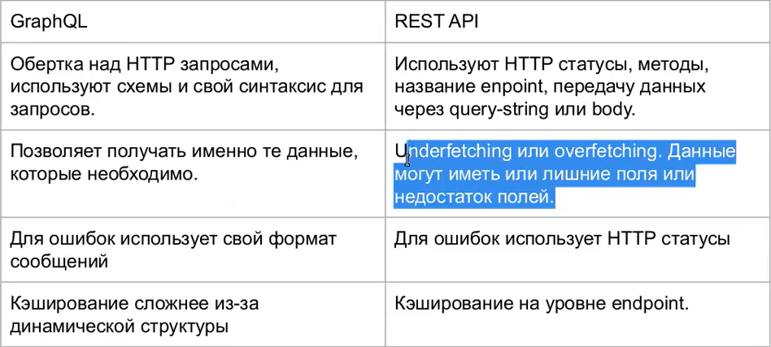

# Seminar M4L25: Введение в GraphQL (23.08.24)

**GraphQL - это:**

- язык запросов API, позволяющий запрашивать точно те данные, которые им нужны с использованием системы типов.

- GraphQL состоит из:
    - **SDL (Schema Definition Language)** - схемы
    - **Query Mutation, Subscription** - запросы
    - **Resolvers** - распознаватели


## SDL

```graphql
type Book {
    id: ID!
    title: String!
    author: Author!
    publishedYear: Int
    genre: String
}

type Author {
    id: ID!
    name: String!
    books: [Book!]!
}
```

### Типы

**Скалярные типы**:

- Int
- Float
- String
- Boolean
- ID 

**Объектные типы**:

- Type
- Enum
- Not Null (!)
- Interface
- Custom types

## Типы запросов

- query - чтение. Позволяет включать только те данные, которые
необходимо. Можно передавать переменные и указывать фрагменты.
- mutation - используются длю созданию/обновлению/удалению.
- subscriptions - позволяют осуществлять подписку на изменению данных.
- resolvers - функции на стороне сервера, которые отвечаю за формированию полей в схеме.

## Преимущества и недостатки

**Преимущества**: 

- единая точка входа

- самодокументируемый API

- Гибкость API (можно запрашивать несколько запросов сразу и получать только необходимые данные)

Недостатки:

- Создание запросов требует специального типа запросов через query

- Ресурсоемкие запросы

- Сложность управление доступа к данным

- Передача файлов


## Сравнение GraphQL с Rest

